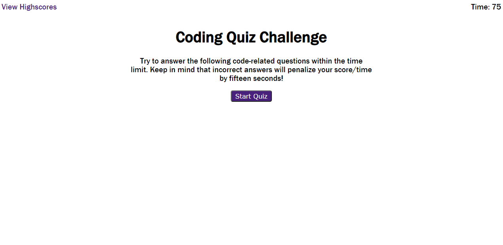

# CodingQuiz
*Coding Quiz utilizing JavaScript and localStorage*

[View Deployed Application Here.](https://pythonidaer.github.io/CodingQuiz/)

## Installation
1. Clone repository to your local device
2. Test by opening the index.html file in your browser. If it looks good, it's working right.
3. If it does not work, right-click Inspect console to determine if there is an issue with the directories.

## Usage
This repo is simply a homework assignment. Feel free to inspect the code and notice how I made a Coding Quiz application:
- Looping over arrays and objects
- Nesting arrays within objects within arrays
- Single-page application
- Functions calling each other
- Utilizing the Storage Object
- Utilizing setTimeout as both a timer() as well as a brief alert popup

## The main parts include:
- `startBtn` when clicked will begin the quiz and start the timer
- `timer()` calls countDown() to go down by one integer every second
- `countDown()` is called until timeRemaining is 0 or quizQuestions array.length - 1
- `renderQuestion()` displays the question object on the screen with buttons
- `toggleQuestion()` compares clicked answers to right/wrong, moves to next question
- `endGame()` transforms timeRemaining to finalScore and prompts user initialsInput
- `checkScore()` when submitBtn is clicked, other scores are gotten; initials verified
- `getScore()` if there is a k:v pair in Storage, parse its JSON string
- `setScore()` add initials and finalScore to newScore() and push to userScores array
- `scoreBoard()` displays scoreboard and loops over all userScores in a list  
- `restartGame()` replaces url with itself to bring back home
- `resetGame()` clears Storage object and also empties HTML content in the `<ul>`
  
## Credits
[Stack Overflow](https://stackoverflow.com/questions/16562577/how-can-i-make-a-button-redirect-my-page-to-another-page) 

[Brian Design](https://www.youtube.com/watch?v=f4fB9Xg2JEY) 

[GitHub: Brian Codex](https://github.com/briancodex/quiz-app-js)

[Coding Quiz App](https://github.com/jenniferkirwin/code-quiz)

[Arrow Functions](https://medium.com/@ExplosionPills/arrow-functions-as-simple-as-i-can-make-them-79d975a7883a)

[setTimeout()](https://www.bitdegree.org/learn/javascript-settimeout)

[Arrow function expressions](https://developer.mozilla.org/en-US/docs/Web/JavaScript/Reference/Functions/Arrow_functions)

[setInterval](https://www.w3schools.com/jsref/met_win_setinterval.asp)

[location.replace()](https://www.w3schools.com/jsref/met_loc_replace.asp)

[Local Browser Storage](https://ui.vision/howto/view-local-storage)

[jQuery.on()](https://api.jquery.com/on/)

[Checking for button clicks in an if statement](https://www.codegrepper.com/code-examples/html/how+to+check+if+a+button+is+clicked+javascript)

[closest()](https://developer.mozilla.org/en-US/docs/Web/API/Element/closest)

[$(this) in Vanilla JavaScript 1](https://stackoverflow.com/questions/42799725/what-is-the-vanilla-javascript-equivalent-to-this-parent-submit)

[$(this) in Vanilla JavaScript 2](https://stackoverflow.com/questions/12481439/jquery-this-keyword)

[.empty()](https://api.jquery.com/empty/)

[DOMContentLoaded](https://stackoverflow.com/questions/807878/how-to-make-javascript-execute-after-page-load)

[.append()](https://developer.mozilla.org/en-US/docs/Web/API/ParentNode/append)

[node.textContent()](https://www.w3schools.com/jsref/prop_node_textcontent.asp)

[.attr()](https://api.jquery.com/attr/)

[.appendChild()](https://developer.mozilla.org/en-US/docs/Web/API/Node/appendChild)

[Jennifer Kirwin code-quiz](https://github.com/jenniferkirwin/code-quiz)

[.dataset](https://developer.mozilla.org/en-US/docs/Web/API/HTMLOrForeignElement/dataset)

[stopPropagation()](https://developer.mozilla.org/en-US/docs/Web/API/Event/stopPropagation)

[Event Delegation, Bubbling, and Capturing](https://gomakethings.com/whats-the-difference-between-javascript-event-delegation-bubbling-and-capturing/)

[Creating and triggering events](https://developer.mozilla.org/en-US/docs/Web/Guide/Events/Creating_and_triggering_events)

[KeyboardEvent](https://developer.mozilla.org/en-US/docs/Web/API/KeyboardEvent)

[keyup event](https://developer.mozilla.org/en-US/docs/Web/API/Document/keyup_event)

[preventDefault()](https://developer.mozilla.org/en-US/docs/Web/API/Event/preventDefault)

[Using data attributes](https://developer.mozilla.org/en-US/docs/Learn/HTML/Howto/Use_data_attributes)

[Using the Web Storage API](https://developer.mozilla.org/en-US/docs/Web/API/Web_Storage_API/Using_the_Web_Storage_API)

[Window.localStorage](https://developer.mozilla.org/en-US/docs/Web/API/Window/localStorage)

[WindowOrWorkerGlobalScope.clearTimeout()](https://developer.mozilla.org/en-US/docs/Web/API/WindowOrWorkerGlobalScope/clearTimeout)

[clearInterval](https://developer.mozilla.org/en-US/docs/Web/API/WindowOrWorkerGlobalScope/clearInterval)

[setInterval()](https://developer.mozilla.org/en-US/docs/Web/API/WindowOrWorkerGlobalScope/setInterval)

[.append()](https://developer.mozilla.org/en-US/docs/Web/API/ParentNode/append)

[DOM](https://developer.mozilla.org/en-US/docs/Web/API/Document_Object_Model)

[How to Traverse the DOM](https://www.digitalocean.com/community/tutorials/how-to-traverse-the-dom)

[:scope](https://developer.mozilla.org/en-US/docs/Web/CSS/:scope)

[Locating DOM elements using selectors](https://developer.mozilla.org/en-US/docs/Web/API/Document_object_model/Locating_DOM_elements_using_selectors)

[.querySelectorAll()](https://developer.mozilla.org/en-US/docs/Web/API/Element/querySelectorAll)

[Storage.clear()](https://developer.mozilla.org/en-US/docs/Web/API/Storage/clear)

[.remove() Method](https://www.w3schools.com/jsref/met_element_remove.asp)

[Hide div after a few seconds](https://stackoverflow.com/questions/820951/hide-div-after-a-few-seconds)

[String toUpperCase()](https://www.w3schools.com/jsref/jsref_touppercase.asp#:~:text=The%20toUpperCase()%20method%20converts,a%20string%20to%20lowercase%20letters.)

[String() Function](https://www.w3schools.com/jsref/jsref_string.asp#:~:text=The%20String()%20function%20converts,()%20of%20the%20individual%20objects.)

[clearTimeout()](https://www.educba.com/javascript-cleartimeout/)

[Loops and Iteration](https://developer.mozilla.org/en-US/docs/Web/JavaScript/Guide/Loops_and_iteration)

[.length - 1](https://stackoverflow.com/questions/19485971/when-to-use-type-length-1-and-type-length-in-java/19486050)

[JSON.parse()](https://developer.mozilla.org/en-US/docs/Web/JavaScript/Reference/Global_Objects/JSON/parse)

[Working with JSON](https://developer.mozilla.org/en-US/docs/Learn/JavaScript/Objects/JSON)

[setItem()](https://developer.mozilla.org/en-US/docs/Web/API/Storage/setItem#:~:text=The%20setItem()%20method%20of,value%20if%20it%20already%20exists.)

[JSON.stringify()](https://developer.mozilla.org/en-US/docs/Web/JavaScript/Reference/Global_Objects/JSON/stringify#:~:text=The%20JSON.,a%20replacer%20array%20is%20specified.)
[location.replace()](https://stackoverflow.com/questions/8293983/how-to-use-window-location-replace-javascript)

[location.replace() MDN](https://developer.mozilla.org/en-US/docs/Web/API/Location/replace)

[Libre Franklin](https://fonts.google.com/specimen/Libre+Franklin?query=franklin&sidebar.open=true&selection.family=Libre+Franklin)

[Deteching button clicked in jQuery](https://stackoverflow.com/questions/7919328/how-to-detect-which-button-is-clicked-using-jquery)

[Mastering Markdown](https://guides.github.com/features/mastering-markdown/)

## Future Improvements
[Find the largest Number in an array](https://www.youtube.com/watch?v=fOFSmCjvcFY)
This video would help me populate scores by High score rather than just all scores.
  
## License
I've chosen an MIT License. Do what you'd like with this material.

#### The Website
